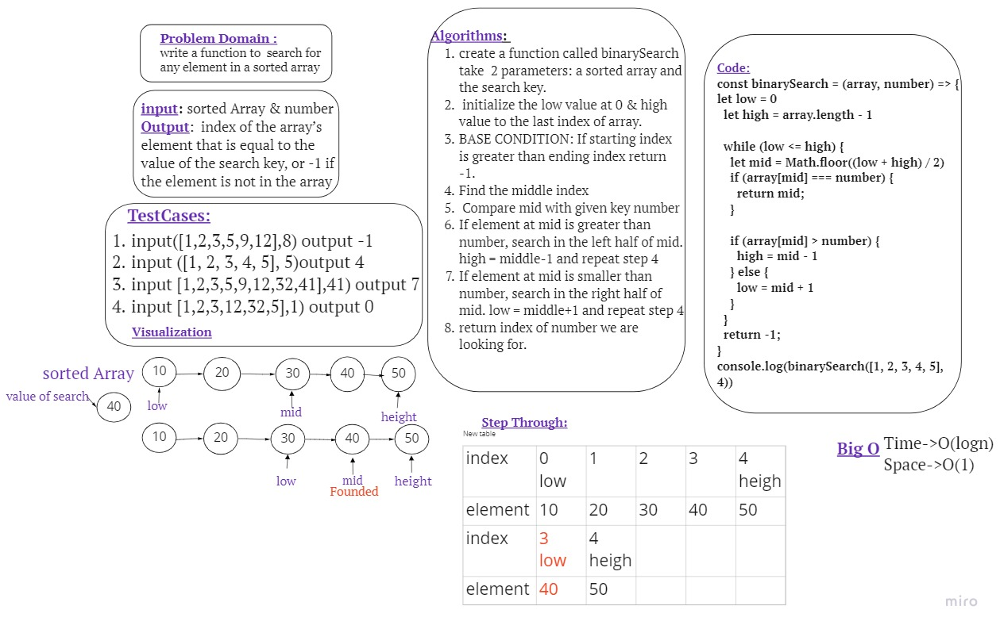

# Array-Binary-Search
Write a function called BinarySearch which takes in 2 parameters: a sorted array and the search key and returns the index of the array’s element that is equal to the value of the search key, or -1 if the element is not in the array.
# Whiteboard Process

# Approach & Efficiency
I used loop approach (while), but no need to loop through of all array's element .it has a O(log(n)) as time complexity and O(1) as space complexity.