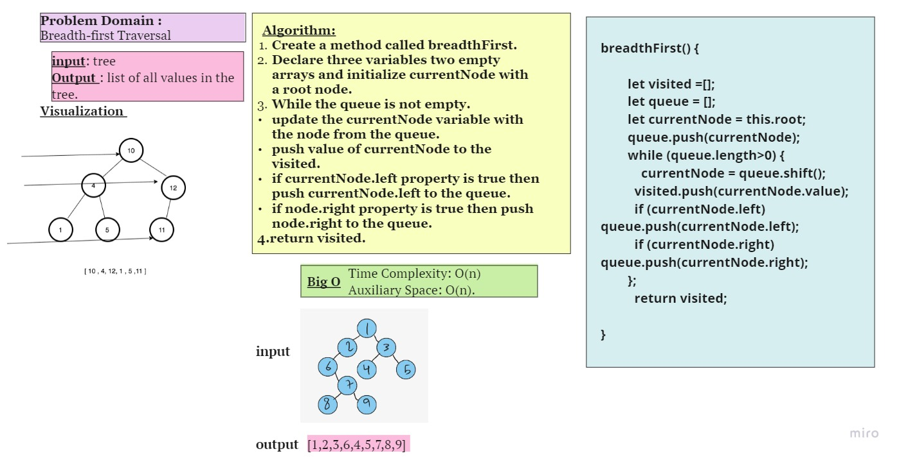
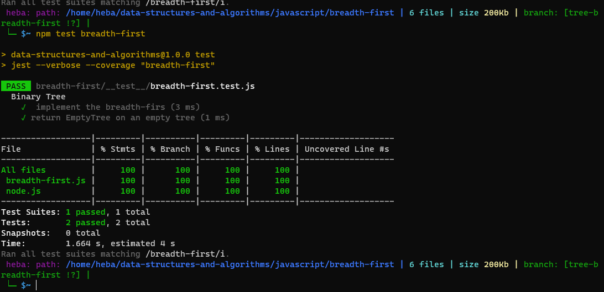

## Breadth-first Traversal.
 Find the Maximum Value in a Binary Tree
Breadth-first search:  it focuses on every item, from left to right, on every level before moving to the next.There are three main parts to this, the current node, our list of visited nodes, and a (array) for keeping track of which nodes we need to look at 
 ## Challenge
 ***function breadthFirst***
 Write a function called breadth first
Arguments: tree
Return: list of all values in the tree, in the order they were encountered
NOTE: Traverse the input tree using a Breadth-first approach
 ## Approach & Efficiency
Time Complexity: O(n) 
Auxiliary Space: O(n). 
## Whiteboard Process

## Test

