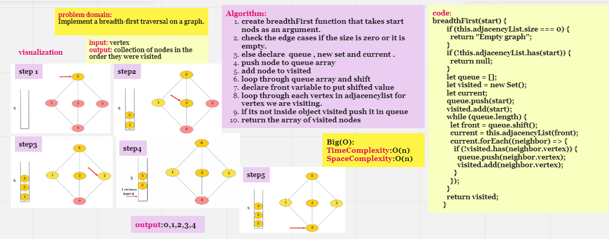
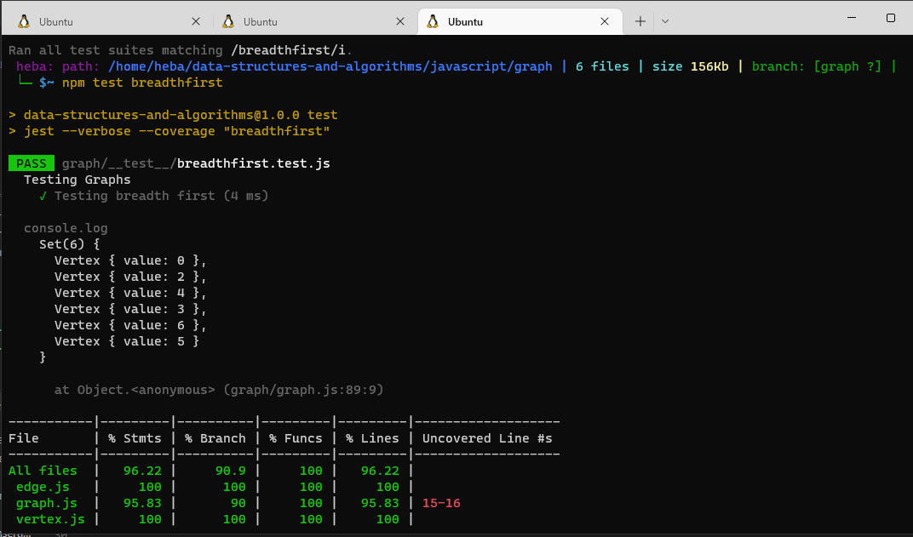

# Graphs

## Introduction

A Graph is a non-linear data structure consisting of a finite set of vertices (nodes) and set of edges which connect a pair of nodes.
Graph Terminology

*   Vertex - a node - data object that can have zero or more adjacent vertices.
*   Edge - a connection between two vertices.
*   Neighbor - the vertex's adjacent vertices (connected to it by edges).
*   Degree - the number of edges connected to that vertex.
# Challenge Summary

Write the following method for the Graph class:

   * breadth first
   * Arguments: Node
   * Return: A collection of nodes in the order they were visited.
   * Display the collection

## Whiteboard Process

## Approach & Efficiency

Time Complexity: O(V + E), where V is the number of nodes and E is the number of edges.
Space :algorithm is O(V), v is the number of nodes

## Test
