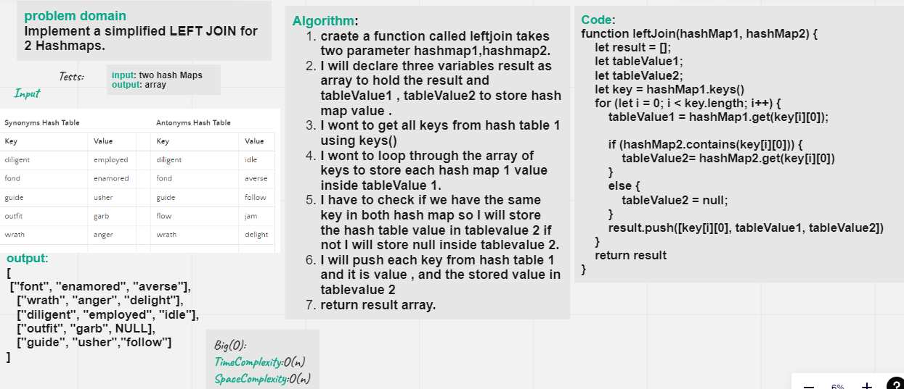
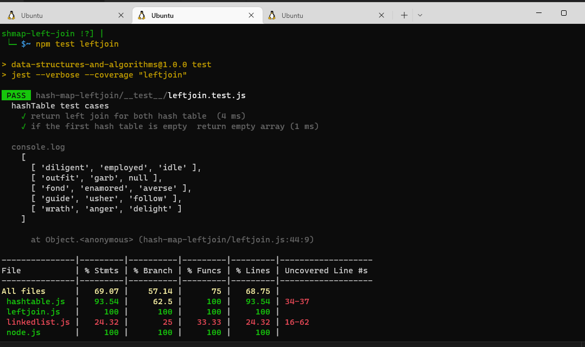

## Hashtables
Implement a simplified LEFT JOIN for 2 Hashmaps.
## Introduction
What Are the Hashtables : they are a data structure that utilize key value pairs. This means every Node or Bucket has both a key, and a value.

The basic idea of a hashtable is the ability to store the key into this data structure, and quickly retrieve the value. This is done through what we call a hash. A hash is the ability to encode the key that will eventually map to a specific location in the data structure that we can look at directly to retrieve the value.

***left join*** returns all the values from the left table, plus matched values from the right table or NULL in case of no matching join predicate.

## whiteboard

## Approach & Efficiency

## API

- Write a function called left join
- Arguments: two hash maps
  - The first parameter is a hashmap that has word strings as keys, and a synonym of the key as values.
  - The second parameter is a hashmap that has word strings as keys, and antonyms of the key as values.
- Return: The returned data structure that holds the results is up to you. It doesn’t need to exactly match the output below, so long as it achieves the LEFT JOIN logic

## test 
