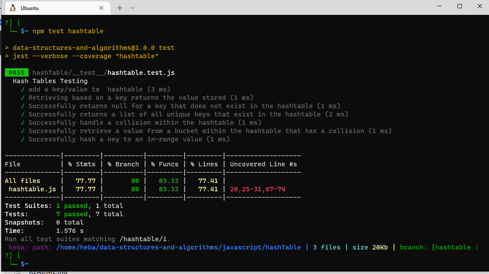

# Hashtables

Hashing is a technique or process of mapping keys, and values into the hash table by using a hash function. It is done for faster access to elements. The efficiency of mapping depends on the efficiency of the hash function used.
## Challenge
Implement a Hashtable Class with the following methods:

1.  set
* Arguments: key, value
* Returns: nothing 

  This method should hash the key, and set the key and value pair in the table, handling collisions as needed.
Should a given key already exist, replace its value from the value argument given to this method.
2. get

* Arguments: key

* Returns: Value associated with that key in the table

3.  contains
* Arguments: key

* Returns: Boolean, indicating if the key exists in the table already.
4. keys

* Returns: Collection of keys

5. makeHash

* Arguments: key

* Returns: Index in the collection for that key

## Approach & Efficiency
* add: space O(1),time O(1)
* makeHash: space O(1),time O(1)
* contains: space O(1),time O(1) - time O(n) if there is a collision
* get: space O(1),time O(1) - time O(n) if there is a collision  

## Test
