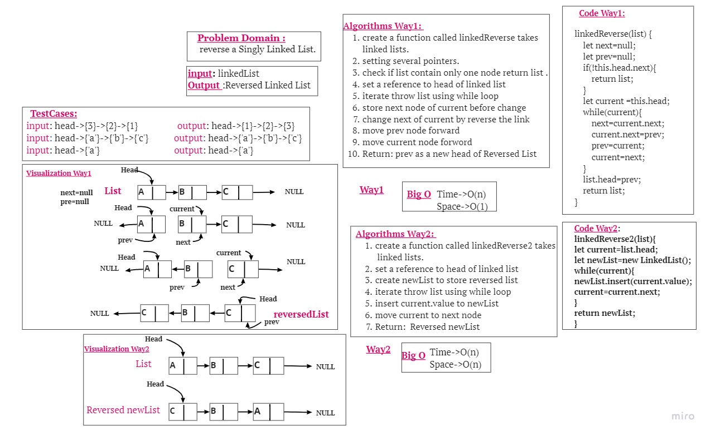

# linked-list-Reverse
 write a function to reverse a Singly Linked List.
# Testing
- [x] list contain one node 
- [x] Reversed list contain more one node
- [x] Firts node in new reversedlist is the last node in input list
# Whiteboard Process

# Approach & Efficiency
In each one of mentioned functions the worst case was to loop through linked list elements, so I used (while) approach and have an O(n) as time complexity, and O(1) as space complexity because there is no need to additional space.