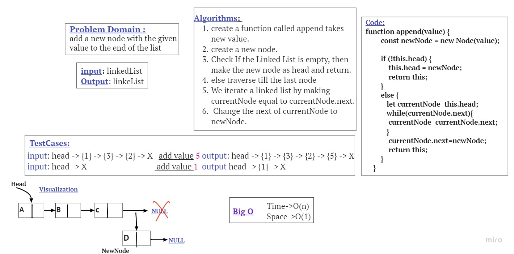
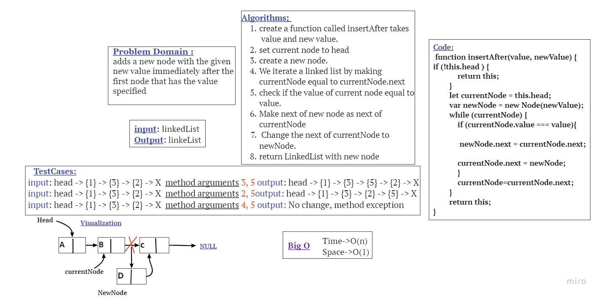

# Singly Linked List
It has one reference and there is refer to next node. start at the head node and navigate from the root until last node that pointing to empty null value.

Implement a linked list by two classes; Node and Linked List.
## methods for the Linked List class:
## append
arguments: new value

adds a new node with the given value to the end of the list

## insert before
arguments: value, new value

adds a new node with the given new value immediately before the first node that has the value specified

## insert after
arguments: value, new value

adds a new node with the given new value immediately after the first node that has the value specified
## Testing
 [x] Can successfully add a node to the end of the linked list.

 [x] Can successfully add multiple nodes to the end of a linked list.

 [x] Can successfully insert a node before a node located i the middle of a linked list.

 [x] Can successfully insert a node before the first node of a linked list.

 [x] Can successfully insert after a node in the middle of the linked list.

 [x] Can successfully insert a node after the last node of the linked list.
# Whiteboard Process
**Add a node to the end of LinkedList**

**Add a node after a given node**

# Approach & Efficiency

In each one of mentioned functions the worst case was to loop through linked list elements, so I used (while) approach and have an O(n) as time complexity, and O(1) as space complexity because there is no need to additional space.

***append:*** Time complexity of append is O(n) where n is the number of nodes in the linked list. Since there is a loop from head to end