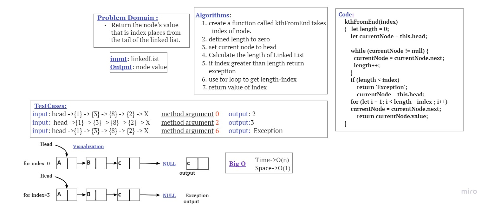

## linked-list-kth
k-th value from the end of a linked list.
## Testing
- [x] Where k is greater than the length of the linked list
- [x] Where k and the length of the list are the same
- [x] Where k is not a positive integer
- [x] Where the linked list is of a size 1
- [x] “Happy Path” where k is not at the end, but - somewhere in the middle of the linked list
# Whiteboard Process

# Approach & Efficiency
In each one of mentioned functions the worst case was to loop through linked list elements, so I used (for) approach and have an O(n) as time complexity, and O(1) as space complexity because there is no need to additional space.