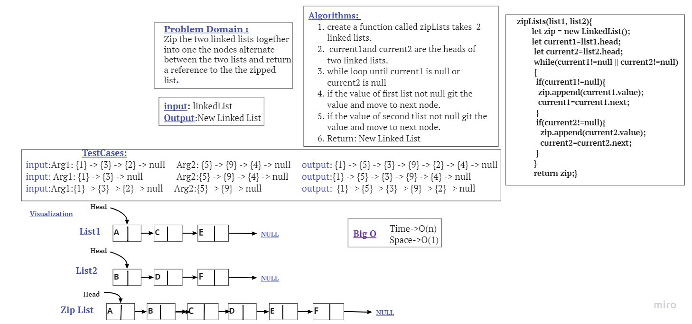

## linked-list-zip
Write a function called zip lists
Arguments: 2 linked lists
Return: New Linked List Zip, the two linked lists together.
## Testing
- [x] merge two linked lists 
- [x] merge two linked lists, list2 had one more node 
- [x] merge two linked lists, list1 had one more node
# Whiteboard Process

# Approach & Efficiency
In each one of mentioned functions the worst case was to loop through linked list elements, so I used (while) approach and have an O(n) as time complexity, and O(1) as space complexity because there is no need to additional space.