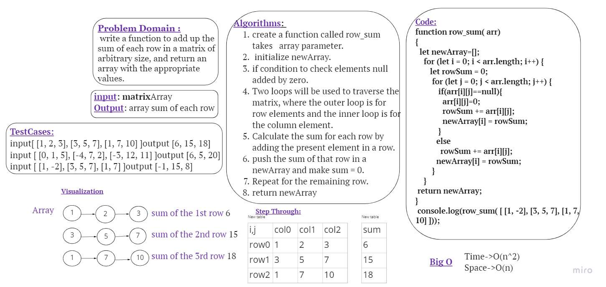

# Matrix
 write a function to add up the sum of each row in a matrix of arbitrary size, and return an array with the appropriate values.
 
 # Whiteboard Process
 

# Approach & Efficiency
I used nested loop approach, it has a **O(n^2)** as **time complexity** and **O(n)** as **space complexity**.