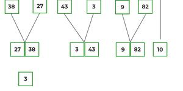

## Merge Sort algorithm
 is a sorting algorithm that is considered an example of the divide and conquer strategy. So, in this algorithm, the array is initially divided into two equal halves and then they are combined in a sorted manner.
 ## Code
 ```js
 function Mergesort(arr) {

    let n = arr.length;
    if (n > 1) {
        let mid = Math.floor(n / 2);
        let left = arr.slice(0, mid);
        let right = arr.slice(mid, n);
        Mergesort(left)
        Mergesort(right)
        Merge(left, right, arr)
    }
}
function Merge(left, right, arr) {
    let i = 0;
    let j = 0;
    let k = 0;
    while (i < left.length && j < right.length){
        if (left[i] <= right[j]) {
            arr[k] = left[i]
            i = i + 1
        }
        else {
            arr[k] = right[j]
            j = j + 1
        }
    k = k + 1;
}
while (i < left.length) {
        arr[k] = left[i];
        k += 1;
        i += 1;
    }
  while (j < right.length){
        arr[k] = right[j];
        k += 1;
        j += 1;
    }
    return arr;  
}
```
## Trace
lets consider an array arr[] = {38, 27, 43, 3, 9, 82, 10}
- At first, check if the left index of array is less than the right index, if yes then calculate its mid point
- divides the whole array into equal halves, unless the atomic values are achieved. 
 we see that an array of 7 items is divided into two arrays of size 4 and 3 respectively.
 - again find that is left index is less than the right index for both arrays, if found yes, then again calculate mid points for both the arrays.

 

 - divide these two arrays into  halves, until the array is reached division is not possible.

 

 - After dividing the array into smallest units, start merging the elements again based on comparison of size of elements
 - compare the element for each list and then combine them into another list in a sorted manner.



- After the final merging, the list looks like this:


## Whiteboard 

## Approach & Efficiency
Big O: 
Time Complexity: O(n log(n)) Merge sort always divides the array into two halves and takes linear time to merge two halves
Space Complexity : O(n) N space is required for merge sort.
## Test

