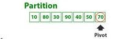
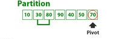
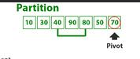
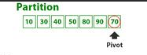
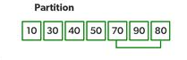
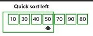
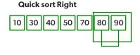
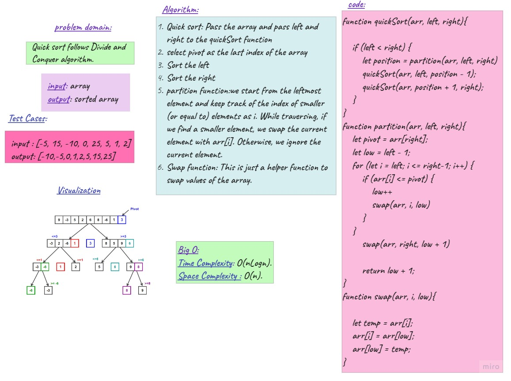
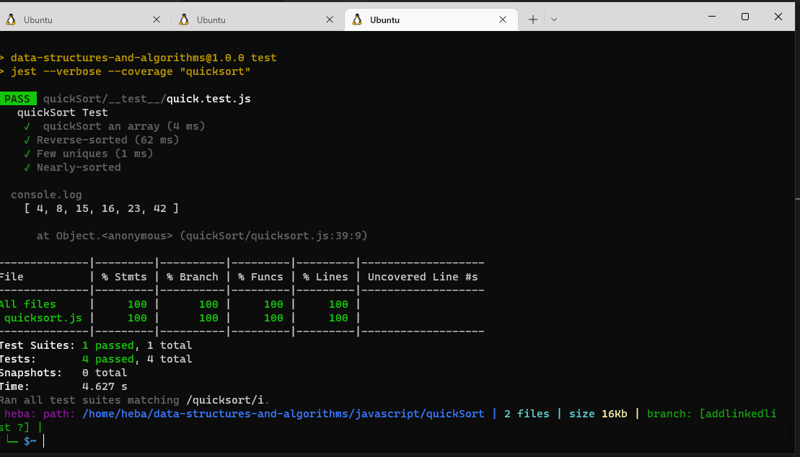

## Quick Sort
Quick sort follows Divide and Conquer algorithm. It is dividing elements in to smaller parts based on some condition and performing the sort operations on those divided smaller parts
## Code
```js
function quickSort(arr, left, right){

    if (left < right) {
        let position = partition(arr, left, right)
        quickSort(arr, left, position - 1);
        quickSort(arr, position + 1, right);
    } 
}

function partition(arr, left, right){
    let pivot = arr[right];
    let low = left - 1;
    for (let i = left; i <= right-1; i++) {
        if (arr[i] <= pivot) {
            low++
            swap(arr, i, low)
        }
    }
        swap(arr, right, low + 1)
      
        return low + 1;  
}

function swap(arr, i, low){

    let temp = arr[i];
    arr[i] = arr[low];
    arr[low] = temp;
}
  ```
## Tests to prove:
* Sample arrays.

* Reverse-sorted.

* Few uniques.

* Nearly-sorted.
## Trace
we want to sort the array,  {10, 80, 30, 90, 40, 50, 70}:
Indexes:  0   1   2   3   4   5   6 
left = 0, right =  6, pivot = arr[right] = 70
Initialize index of smaller element, i = -1



Traverse elements from j = left to right-1

j = 0: arr[j] <= pivot, do i++ and swap(arr[i], arr[j])
i = 0
arr[] = {10, 80, 30, 90, 40, 50, 70} // No change as i and j are same

j = 1:  arr[j] > pivot, do nothing


j = 2 : Since arr[j] <= pivot, do i++ and swap(arr[i], arr[j])

i = 1
arr[] = {10, 30, 80, 90, 40, 50, 70} // We swap 80 and 30



j = 3 :  arr[j] > pivot, do nothing // No change in i and arr[]

j = 4 : arr[j] <= pivot, do i++ and swap(arr[i], arr[j])

i = 2

arr[] = {10, 30, 40, 90, 80, 50, 70} // 80 and 40 Swapped



j = 5 :  arr[j] <= pivot, do i++ and swap arr[i] with arr[j]

i = 3

arr[] = {10, 30, 40, 50, 80, 90, 70} // 90 and 50 Swapped



We come out of loop because j is now equal to right-1.

Finally we place pivot at correct position by swapping arr[i+1] and arr[right] ( pivot)

arr[] = {10, 30, 40, 50, 70, 90, 80} // 80 and 70 Swapped



Now 70 is at its correct place. All elements smaller than 70 are before it and all elements greater than 70 are after it.

Since quick sort is a recursive function, we call the partition function again at left and right partitions



Again call function at right part and swap 80 and 90




## Approach & Efficiency
I used the Array approach with two for loops

 Time Complexity:  The big O => O(nLogn).

Space Complexity: The big O => O(n) .
## WhiteBoard

## Test

## Examples:
```js
//Sample arrays//
let arr = [8, 4, 23, 42, 16, 15];
quickSort(arr, 0, arr.length - 1);
console.log(arr); // Output: [4, 8, 15, 16, 23, 42]

// Reverse-sorted
let arr1 = [20, 18, 12, 8, 5, -2];
quickSort(arr1, 0, arr1.length - 1);
console.log(arr1); // Output: [-2, 5, 8, 12, 18, 20]

// Few uniques.
let arr2 = [5, 12, 7, 5, 5, 7];
quickSort(arr2, 0, arr2.length - 1);
console.log(arr2);  // Output: [5, 5, 5, 7, 7, 12]

//Nearly-sorted.
let arr3 = [2, 3, 5, 7, 13, 11];
quickSort(arr3, 0, arr3.length - 1);
console.log(arr3); // Output: [2, 3, 5, 7, 11, 13]
```
