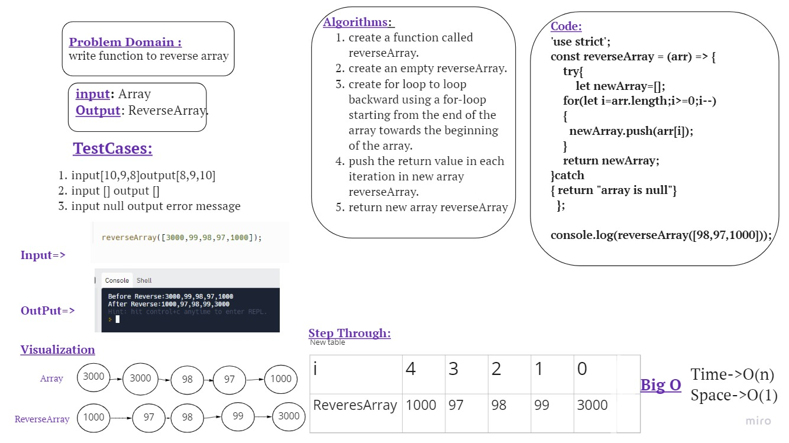

# Reverse an Array
<!-- Description of the challenge -->
**ReverseArray** function takes an array as an argument. Without utilizing any of the built-in methods available to my language, return an array with elements in reversed order.

## Whiteboard Process

## Approach & Efficiency
- The standard approach is to loop backward using a ***for-loop*** starting from the end of the array towards the beginning of the array.
- push the return value in each iteration in new array reverseArray.