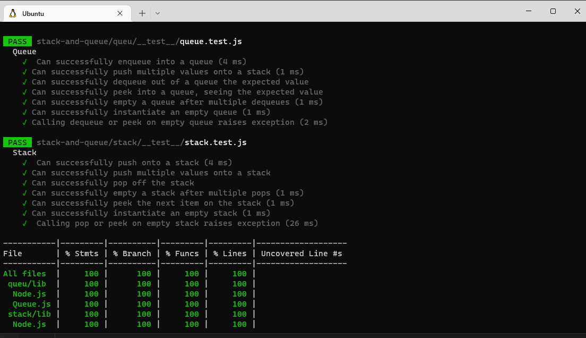

# Stacks and Queues
Stacks and Queues are data structures that follow different patterns.

## Challenge
Create a stack and queue with all operiations that could be applied on them.
- functions for Stack class (pop,push,inEmpty and peek) 
- functions for Queue class(enqueue,dequeue,peek and isEmpty) 

## Approach & Efficiency
All of created functions take a big O equals to O(1), because we didn't use any loop approaches not care how many nodes in it.

## API

### Stack class:
1. **push(value)**
    - adds a new node with that value to the top of the stack with an O(1) Time performance.
2. **pop()**
    - Returns: the value from node from the top of the stack.
    - Removes the node from the top of the stack.
    - Should raise exception when called on empty stack.
3. **peek()**.
    - Returns: Value of the node located at the top of the stack.
    - Should raise exception when called on empty stack.
4. **isEmpty()**
    - Returns: Boolean indicating whether or not the stack is empty.

### Queue class:
1. **enqueue(value)**
    - adds a new node with that value to the back of the queue with an O(1) Time performance.
2. **dequeue()**
    - Returns: the value from node from the front of the queue.
    - Removes the node from the front of the queue.
    - Should raise exception when called on empty queue.
3. **peek()**
    - Returns: Value of the node located at the front of the queue.
    - Should raise exception when called on empty stack.
4. **isEmpty()**
    - Returns: Boolean indicating whether or not the queue is empty.
    ## Testing
    