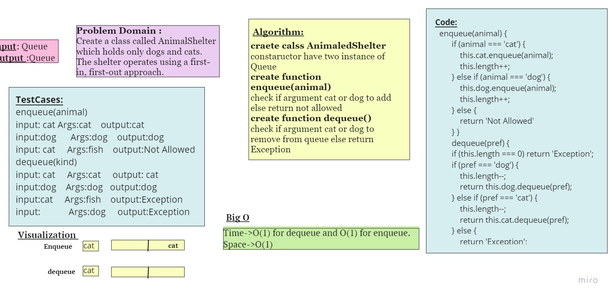
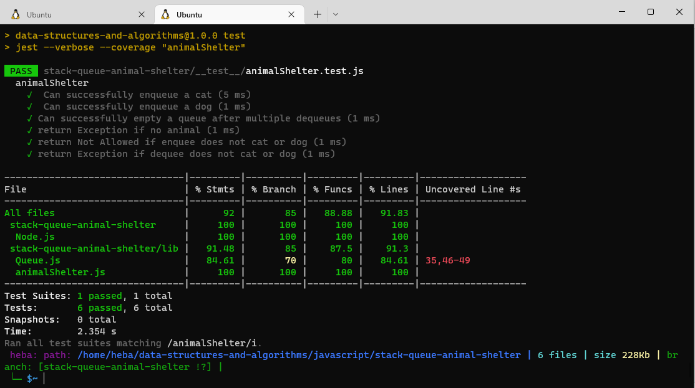

## stack-queue-animal-shelter
Create a class called AnimalShelter which holds only dogs and cats.
The shelter operates using a first-in, first-out approach.

## ## Challenge
- Create a new class called **AnimalShelter**.

- **Methods:**
  - enqueue
    - Arguments: animal
    - animal can be either a dog or a cat object.
    - Inserts animal using a first-in, first-out approach.
   - dequeue
     - Arguments: pref
     - pref can be either "dog" or "cat"
     - Extracts a pref using a first-in, first-out approach.
 ## Approach & Efficiency
Time Complexity: O(1) for dequeue and O(1) for enqueue.
Space Complexity: O(1)
## Whiteboard Process

## Test

