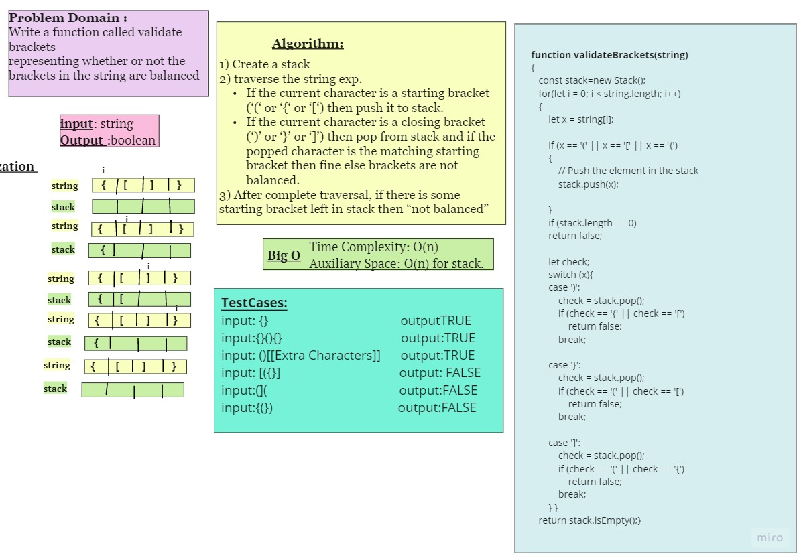
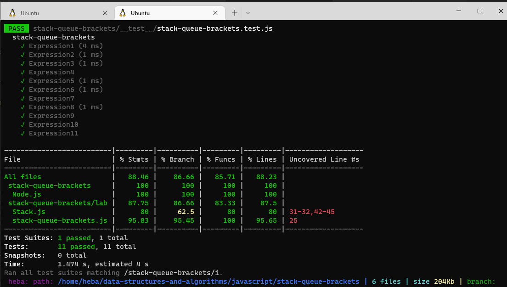

 
 ## stack-queue-brackets
  Checking valid brackets using stack
 ## Challenge
- function called **validateBrackets**
   - Arguments: string
  - Return: boolean
    - representing whether or not the brackets in the  string are balanced

 ## Approach & Efficiency
Time Complexity: O(n) 
Auxiliary Space: O(n) for stack. 
## Whiteboard Process

## Test

