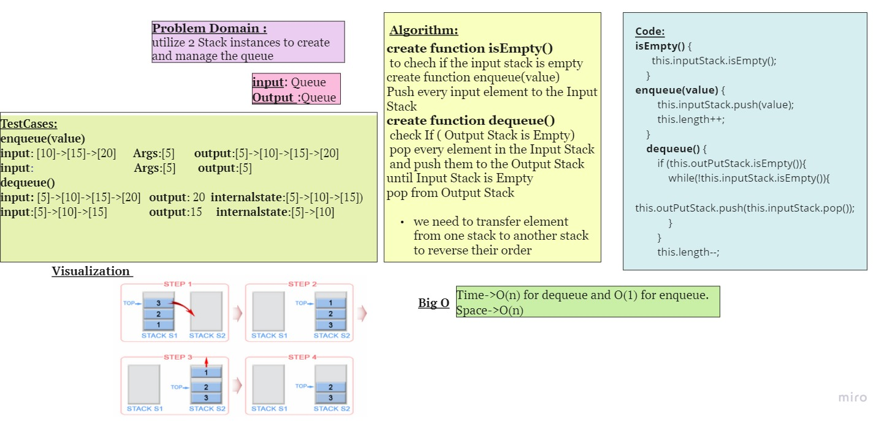
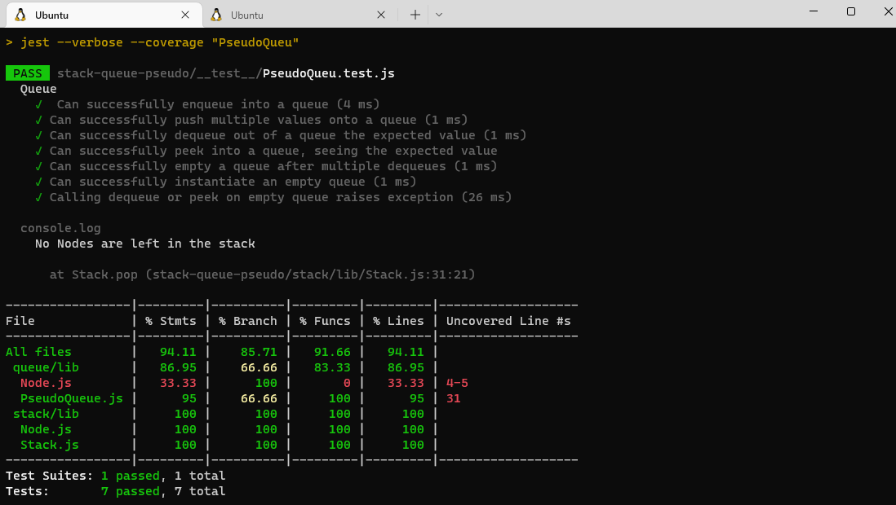

## stack-queue-pseudo
 utilize 2 Stack instances to create and manage the queue.we need to transfer element from one stack to another stack to reverse their order.
## Challenge
 - Class PseudoQueue.
- Do not use an existing Queue. Instead, this PseudoQueue class will implement our standard queue interface
- Internally, utilize 2 Stack instances to create and manage the queue

## Approach & Efficiency
Time Complexity: O(N) for dequeue and O(1) for enqueue.
Space Complexity: O(N)
## API
- Create a new class called **pseudo queue**.
- **Methods:**
  - enqueue
    - Arguments: value
    - Inserts value into the PseudoQueue, using a first-in, first-out approach.
   - dequeue
     - Arguments: none
     - Extracts a value from the PseudoQueue, using a first-in, first-out approach.
## Whiteboard Process

## Test

