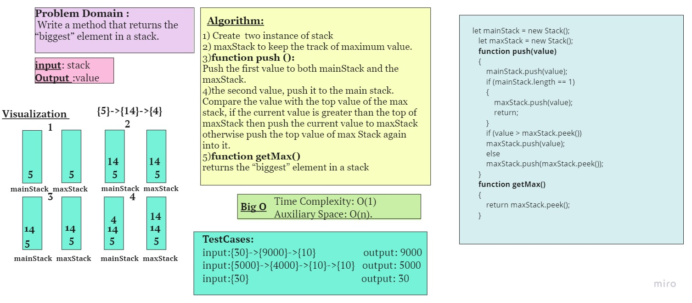

 ## stack-getMax
  Write a method that returns the “biggest” element in a stack
 ## Challenge
 Create  two instance of stack maxStack and mainStack 
 maxStack to keep the track of maximum value.
- function called **push**
   - Arguments: value
   - If current element is greater than the top element of max stack, push the current element to max stack otherwise push the element at top of  max stack again into it
- function called **getMax**
  - Return: “biggest” element in a stack

 ## Approach & Efficiency
Time Complexity: O(1) 
Auxiliary Space: O(n). 
## Whiteboard Process

