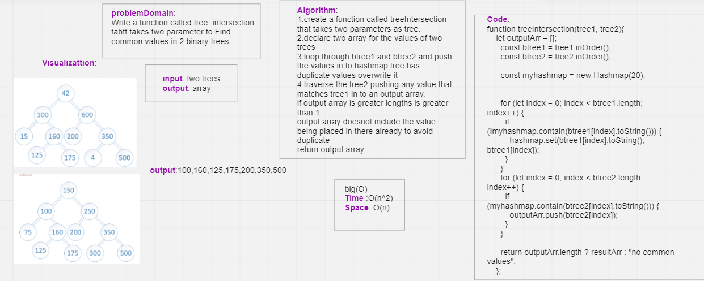
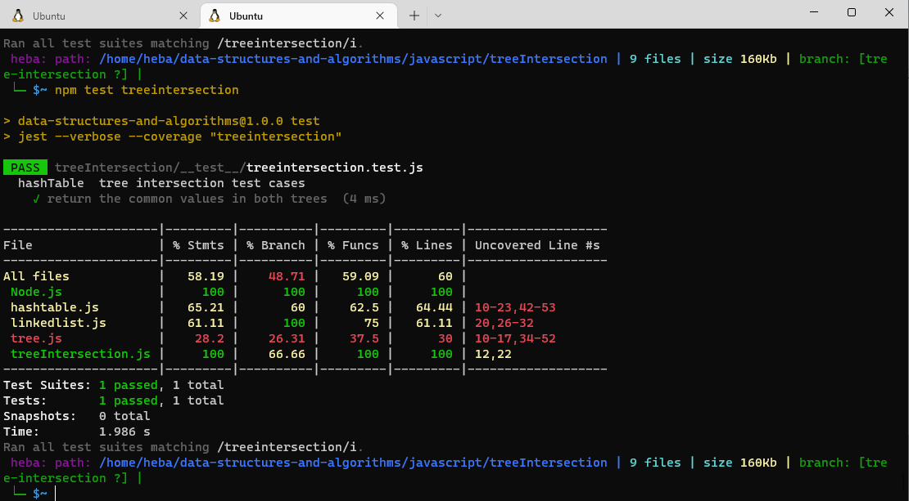

## Hash Table - Tree Intersection
Find common values in 2 binary trees.
## whiteboard

## Note what i did?
I had create a function called treeintersection that takes two parameters:tree1,tree2. I used preorder method in class BinaryTree
to traverse through tree1 and tree2 and store the values of their nodes inside array called btree1 and btree2 respectively. I created myhashmap and traverse through value of tree1 and hash them by set method.I traversed through values of tee2 and check if these values inside myhashmap so push them in resultArray when I finished looping I returned the resultArray
## Approach & Efficiency
The big O => O(n^2) time.recursion funtion

The big O => O(n) space.
## API
Write a function called tree_intersection that takes two binary trees as parameters. Using your Hashmap implementation as a part of your algorithm, return a set of values found in both trees.

input : two binary tree
output :array contain same value in trees
## test 
