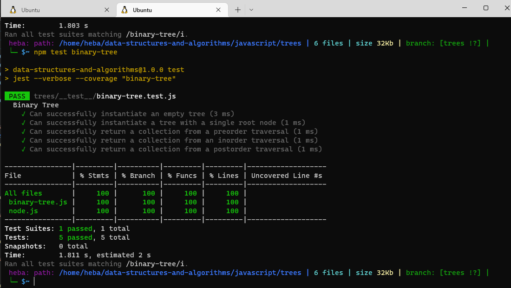
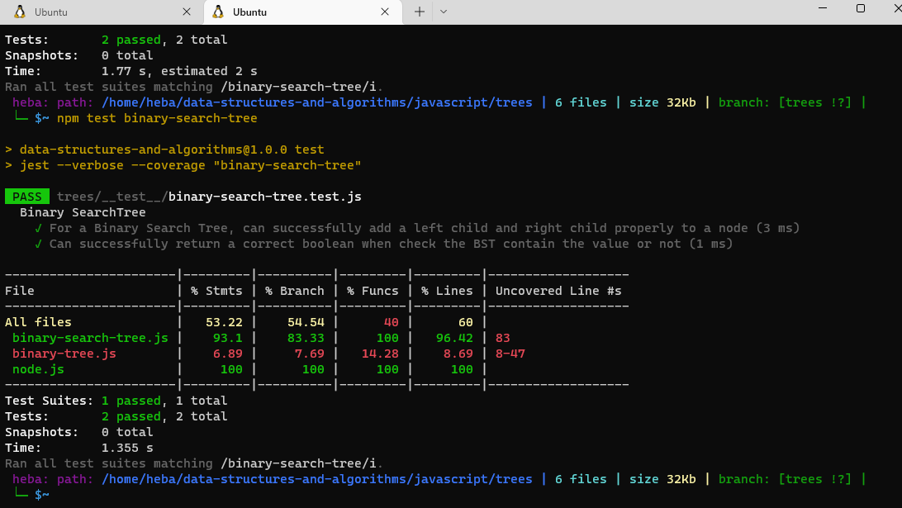

##  Binary Tree and BST Implementation
## Challenge
- **Node**

Create a Node class that has properties for the value stored in the node, the left child node, and the right child node.
- **Binary Tree**
  - Create a Binary Tree class
  - Define a method for each of the depth first traversals:
    1. pre order
    2.  in order
    3.  post order which returns an array of the values, ordered appropriately.
- **Binary Search Tree**
  - Create a Binary Search Tree class
  - This class should be a sub-class  of the Binary Tree Class, with the following **methods:**
    1. **Add**
    - Arguments: value
    - Return: nothing
    - Adds a new node with that value in the correct location in the binary search tree.
    2. **Contains**
    - Argument: value
    - Returns: boolean indicating whether or not the value is in the tree at least once.
## Approach & Efficiency
Big O for preOrder is O(n)

Big O for inOrder is O(n)

Big O for postOrder is O(n)

Big O for add is O(n)

Big O for contains is O(log n)
## Whiteboard Process

## Test
### Binary Tree Test

### Binary Search Tree Test

