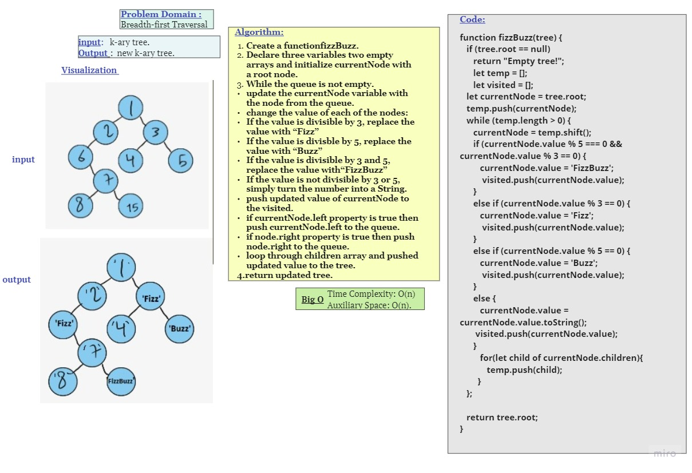
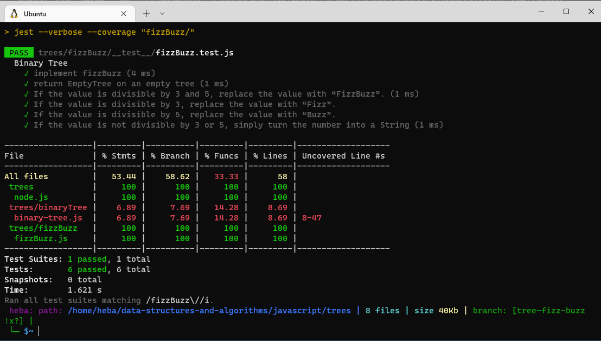

# FizzBuzz on Tree

Conduct “FizzBuzz” on a tree while traversing through it. Change the values of each of the nodes dependent on the current node’s value.

## Challenge

Write a function called FizzBuzzTree that takes a tree as an argument and creates a new tree with values:
- divisible by 3 replaced with Fizz
- divisible by 5 replaced with Buzz
- divisible by 3 or 5 replaced with FizzBuzz
- not divisible by 3 or 5 simply turn number to string

Then return the new tree

## Approach & Efficiency

Take tree and make a new one, Traverse new tree as a inordered list traversal and 
- if value%3==0 &&  value%5==0 value='FizzBuzz'
- else if value%3==0 value = 'Fizz'
- else if value%5==0 value = 'Buzz'
- else if value = value.tostring
return root node of tree

- Time O(n) because we traverse the whole tree
- Space O(n) because we rewrite the whole tree.

## API

fizzBuzzTree(tree)
returns new tree 

## WhiteBoard

## Test

