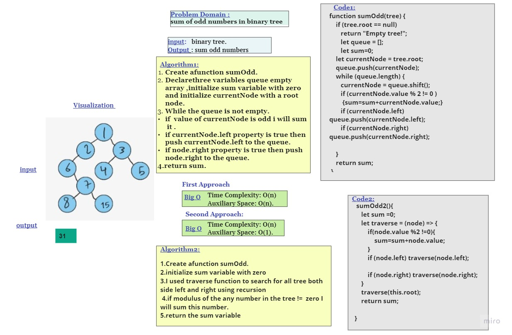

## Sum of numbers in a binary tree
 Find the sum of all the odd numbers in a binary search tree. 
 ## Challenge
 ***function sumOdd***
Find the sum of all the odd numbers in a binary search tree. 
Any of the traversals (depth or breadth) 
I used 2 approach to solve this challenge first approch breadthFirst , the second approach Depth first.
***Algorithm1:***
1. Create afunction sumOdd.
2. Declarethree variables queue empty array ,initialize sum variable with zero and initialize currentNode with a root node.
3. While the queue is not empty.
- if  value of currentNode is odd i will sum  it .
- if currentNode.left property is true then push currentNode.left to the queue.
- if node.right property is true then push node.right to the queue.
4. return sum.

***Algorithm2:***
1. Create afunction sumOdd.
2. initialize sum variable with zero
3. I used traverse function to search for all tree both side left and right using recursion
4. if modulus of the any number in the tree !=  zero I will sum this number.
5. return the sum variable

 ## Approach & Efficiency
**First Approach:**
- Time Complexity: O(n) 
- Auxiliary Space: O(n).

**Second Approach:**
- Time Complexity: O(n) 
- Auxiliary Space: O(1)

## Whiteboard Process

## Test

