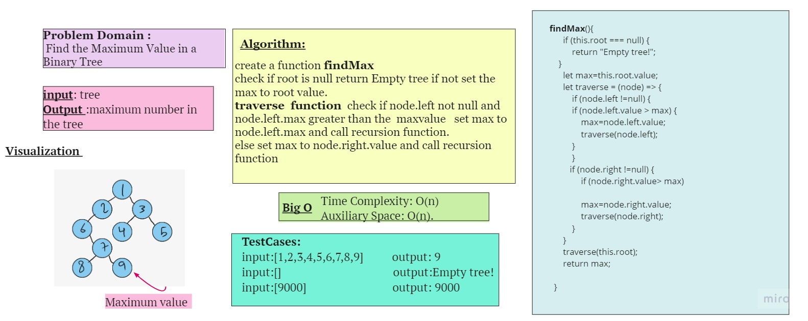

## stack-getMax
 Find the Maximum Value in a Binary Tree
 ## Challenge
 ***function findMax***
 find maximum value
Arguments: none
Returns: number
Find the maximum value stored in the tree. You can assume that the values stored in the Binary Tree will be numeric.

 ## Approach & Efficiency
Time Complexity: O(n) 
Auxiliary Space: O(n). 
## Whiteboard Process

## Test

